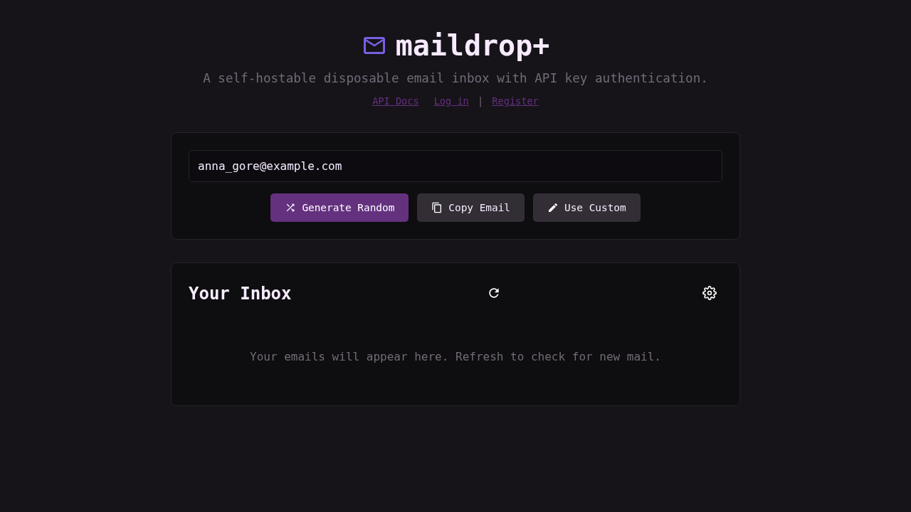
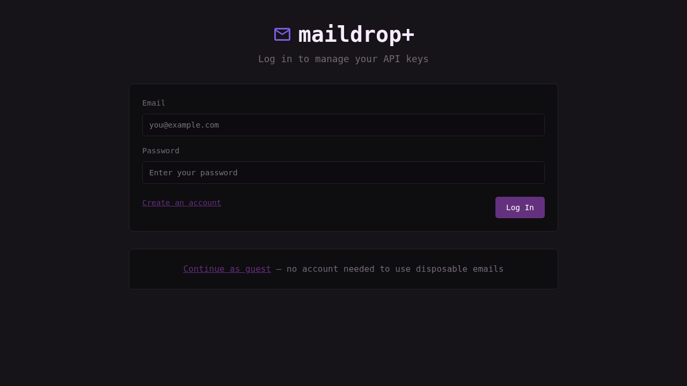
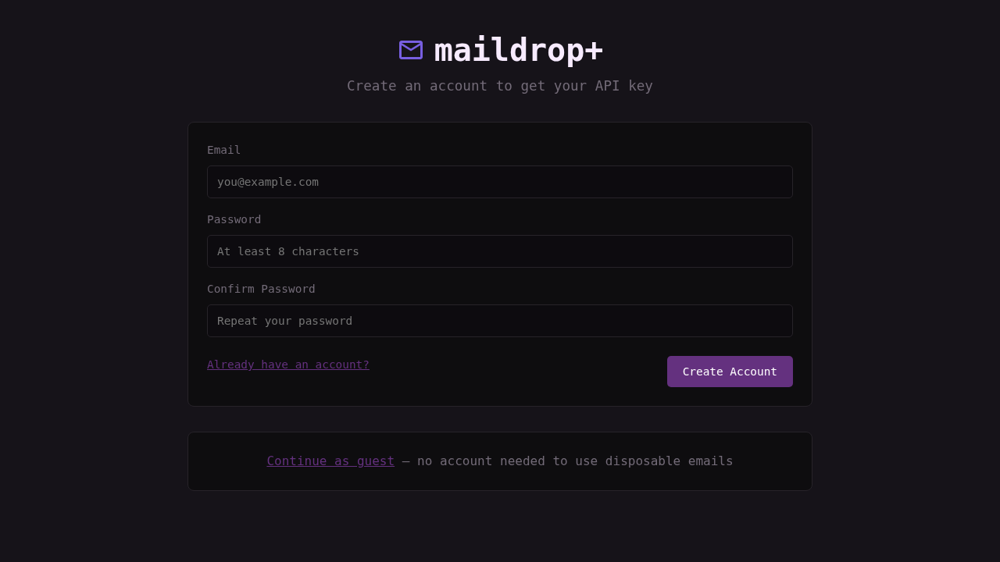

<h1>
    
    Maildrop+
</h1>

*A self-hostable disposable email inbox with SMTP server, user accounts, and API key authentication — forked and enhanced for AI LLM agent access*


*Main inbox view — generate random addresses, copy to clipboard, and read incoming emails.*


*Login page — registered users can sign in to manage their API keys.*


*Registration page — create an account and receive an API key automatically.*

## Table of Contents
- [About The Project](#about-the-project)
  - [Features](#features)
- [Getting Started](#getting-started)
  - [Prerequisites](#prerequisites)
  - [Installation](#installation)
- [Connecting to your domain](#connecting-to-your-domain)
  - [Example DNS configurations](#example-dns-configurations)
- [Configuration](#configuration)
- [User Accounts & API Keys](#user-accounts--api-keys)
  - [Guest mode](#guest-mode)
  - [Registration & login](#registration--login)
  - [API key management](#api-key-management)
- [Security](#security)
  - [Rate limiting](#rate-limiting)
  - [Email size limits](#email-size-limits)
  - [Per-inbox storage with eviction](#per-inbox-storage-with-eviction)
  - [Address ownership](#address-ownership)
  - [Privilege separation](#privilege-separation)
  - [SMTP STARTTLS](#smtp-starttls)
  - [CSRF / Origin validation](#csrf--origin-validation)
  - [Security headers](#security-headers)
  - [Session security](#session-security)
- [Sending](#sending)
- [API Reference](#api-reference)
- [License](#license)
- [Why this fork?](#why-this-fork)

## About The Project

Maildrop+ is a self-hostable disposable email service that receives emails on any address on one or more of your domains. It runs a lightweight SMTP server (port 25) and a web panel (port 5000) for browsing received emails.

It is designed for:
- **AI LLM agents** — agents get their own API key, generate addresses, receive and send email entirely through the REST API
- People who want to easily use multiple email addresses
- Signing up for services without using your main email address
- Easily creating multiple accounts on websites

### Features

- [x] Multi-domain support (receive on multiple domains simultaneously)
- [x] Random email generation with human-readable patterns
- [x] Use custom emails
- [x] Support for password protected inboxes
- [x] Clean dark-themed UI
- [x] Easy setup
- [x] **User accounts** — register, log in, manage your addresses
- [x] **API key authentication** — each user gets one API key for programmatic access
- [x] **Guest mode** — use the web panel without an account
- [x] **Address ownership** — addresses are claimed on generation and tied to your account
- [x] **Address limit** — max 10 addresses per user
- [x] **User flags** — per-user feature flags (e.g. `custom_email` for manual address entry)
- [x] Per-inbox storage with oldest-first eviction
- [x] Per-IP rate limiting (SMTP + HTTP auth endpoints)
- [x] Anti-detection SMTP features (generic banner, random delays, unknown-recipient rejection)
- [x] Privilege separation (drops root after binding SMTP)
- [x] (Optional) SMTP STARTTLS
- [x] (Optional) Sending emails — [Set up sending](#sending)

## Getting Started

### Prerequisites

- Python 3.9+
- pip
- Port 25 must be accessible (some ISPs block it — you may need a VPS)

### Installation

1.  **Clone the repository**

    ```bash
    git clone https://github.com/haileyydev/maildrop.git
    cd maildrop
    ```

2.  **Create a venv and activate it**

    ```bash
    python -m venv venv
    source venv/bin/activate
    ```

3.  **Install the requirements**

    ```bash
    pip install -r requirements.txt
    ```

4.  **Configure the environment**

    ```bash
    cp .env.example .env
    # Edit .env — at minimum set DOMAINS and PASSWORD
    ```

5.  **Run the application**

    ```bash
    sudo python app.py
    ```

Maildrop+ will be running on port 5000 (web panel) and port 25 (SMTP).

**Root is required only to bind port 25.** The SMTP server drops privileges to `nobody` immediately after binding. If you use a port redirect (e.g. `authbind`), root is not needed.

## Connecting to your domain(s)

Follow this guide to set up receiving emails on your domain(s). Maildrop+ supports multiple domains — just set `DOMAINS` to a comma-separated list (e.g. `DOMAINS=domain1.com,domain2.com`).

1. **Ensure port `25` is open**  
   This is the port the SMTP server uses. Some ISPs block this — you may need a tunnel or host Maildrop+ in the cloud.

2. **Create an `A` record for each domain**  
   Point it to the public IP address of the server running Maildrop+.

3. **Create an `MX` record for each domain**  
   Point it to the domain you created the `A` record on.

4. **Edit `.env` and set `DOMAINS` to your domain(s)**  
   Comma-separated list of domains to accept mail for (e.g. `DOMAINS=domain1.com,domain2.com`).

---

### Example DNS configurations

**If you are running Maildrop+ on a different domain/subdomain than the one you are receiving emails on:**

| Type | Domain                | Points To                |
| ---- | --------------------- | ------------------------ |
| `A`  | `maildrop.domain.com` | Your server's IP address |
| `MX` | `domain.com`          | `maildrop.domain.com`    |

In this configuration, access Maildrop+ at `http://maildrop.domain.com:5000` (or preferably `https://maildrop.domain.com` behind a reverse proxy).

---

**If you are running Maildrop+ on the same domain as the one you are receiving emails on:**

| Type | Domain       | Points To                |
| ---- | ------------ | ------------------------ |
| `A`  | `domain.com` | Your server's IP address |
| `MX` | `domain.com` | `domain.com`             |

## Configuration

Create a `.env` file (copy `.env.example` for a template).

| Variable                | Default            | Description                                                |
| ----------------------- | ------------------ | ---------------------------------------------------------- |
| `FLASK_HOST`            | `0.0.0.0`          | Host for the web panel.                                    |
| `FLASK_PORT`            | `5000`             | Port for the web panel.                                    |
| `SMTP_HOST`             | `0.0.0.0`          | Host for the SMTP server.                                  |
| `SMTP_PORT`             | `25`               | Port for the SMTP server.                                  |
| `DOMAINS`               | `yourdomain.com`   | Comma-separated list of domains to accept mail for.        |
| `PASSWORD`              | `password`         | Password for protected inboxes. **Change this.**           |
| `PROTECTED_ADDRESSES`   | `^admin.*`         | Regex for inboxes that require a password.                 |
| `ENABLE_SENDING`        | `false`            | Enable outbound email sending.                             |
| `SMTP_RATE_LIMIT`       | `10`               | Max SMTP connections per IP per window.                    |
| `SMTP_RATE_WINDOW`      | `60`               | Rate limit window in seconds.                              |
| `SMTP_MAX_MSGS_PER_CONN`| `20`               | Max messages per SMTP connection.                          |
| `MAX_EMAIL_SIZE`        | `10000000`         | Max raw email size in bytes (10 MB).                       |
| `MAX_EMAILS_PER_INBOX`  | `500`              | Max emails per inbox before oldest-first eviction.         |
| `DROP_PRIV_USER`        | _(empty)_          | User to drop privileges to after binding SMTP port.        |
| `SMTP_TLS_CERT`         | _(empty)_          | Path to TLS certificate file for SMTP STARTTLS.            |
| `SMTP_TLS_KEY`          | _(empty)_          | Path to TLS private key file for SMTP STARTTLS.            |
| `ALLOWED_ORIGINS`       | _(empty)_          | Comma-separated origins allowed for `POST /send`.    |
| `FLASK_SECRET_KEY`      | _(empty)_          | Secret key for Flask session signing (auto-generated if empty). |
| `RELAY_HOST`            | _(empty)_          | SMTP relay host for sending emails.                        |
| `RELAY_PORT`            | `2525`             | SMTP relay port.                                           |
| `RELAY_USER`            | _(empty)_          | SMTP relay username (optional).                            |
| `RELAY_PASS`            | _(empty)_          | SMTP relay password (optional).                            |

## User Accounts & API Keys

Maildrop+ supports user accounts with session-based authentication and per-user API keys.

### Guest mode

The web panel works without an account — you can generate random addresses and read inboxes as a guest. Guest-generated addresses are not tied to any user and are accessible to anyone who knows the address. Guests cannot send emails or create API keys.

### Registration & login

- **`/auth/register`** — Create an account with email and password. An API key is automatically generated on registration.
- **`/auth/login`** — Log in to an existing account.
- **`/auth/logout`** — End your session.

Once logged in, addresses you generate are **claimed** to your account (max 10 per user). Only you can read their inboxes (unless the address matches a protected-address pattern and the global password is provided).

### API key management

Each user is limited to **one active API key**. Keys are stored in the database and returned by `/auth/me`, so they persist across browsers and sessions.

- **`POST /auth/generate`** — Revoke the current key and generate a new one (requires session).
- **`Authorization: Bearer <key>`** — Use this header for programmatic API access.

All API endpoints that require authentication accept either a session cookie (web UI) or a bearer token (programmatic).

## Security

Maildrop+ includes several security features to protect your deployment.

### Rate limiting

- **SMTP** — Per-IP rate limiting (`SMTP_RATE_LIMIT` connections per `SMTP_RATE_WINDOW` seconds) and per-connection message caps (`SMTP_MAX_MSGS_PER_CONN`). Exceeded connections receive SMTP code `452`.
- **Auth endpoints** — Login and registration are rate-limited to 10 attempts per 60 seconds per IP. Returns HTTP `429` when exceeded.

### Email size limits

Emails larger than `MAX_EMAIL_SIZE` (default 10 MB) are rejected at the SMTP protocol level and by the parser as a defence-in-depth measure.

### Per-inbox storage with eviction

Each recipient's emails are stored in a separate file under `INBOX_DIR` (default `inboxes/`). When an inbox exceeds `MAX_EMAILS_PER_INBOX` (default 500), the oldest emails are evicted first — no silent global data loss.

### Address ownership

When a logged-in user generates a random address, it is claimed to their account (max 10 per user). Attempting to read another user's address returns `403 Forbidden`. Guest-generated addresses are unclaimed and publicly accessible.

### User flags

Users can be assigned feature flags stored as a comma-separated list in the `flags` column. The `custom_email` flag enables manual address entry in the "Use Custom" modal — users with this flag can type any address on an accepted domain, while users without it can only select from their owned addresses.

### Privilege separation

The SMTP server binds port 25 as root, then immediately drops privileges to `DROP_PRIV_USER`. The web panel never runs as root.

### SMTP STARTTLS

Set `SMTP_TLS_CERT` and `SMTP_TLS_KEY` to enable STARTTLS on the SMTP server. When configured, the server advertises STARTTLS and upgrades connections to TLS.

### CSRF / Origin validation

When `ALLOWED_ORIGINS` is set (comma-separated), `POST /send` requests are validated against the `Origin` header (with `Referer` fallback). Requests from unlisted origins receive a `403 Forbidden` response.

### Security headers

The web panel sets the following HTTP security headers on all responses:

- `X-Content-Type-Options: nosniff`
- `X-Frame-Options: DENY`
- `X-XSS-Protection: 1; mode=block`
- `Content-Security-Policy` — same-origin with inline scripts allowed for auth pages
- `Referrer-Policy: strict-origin-when-cross-origin`

### Session security

- Sessions are signed with `FLASK_SECRET_KEY` (auto-generated if not set).
- Session cookies are `HttpOnly` and `SameSite=Lax`.
- Session ID is regenerated on login to prevent session fixation.
- Sessions expire after 30 days of inactivity.

## Sending

Maildrop+ also supports sending mail as an optional feature. Visit the [Sending Guide](docs/SENDING.md) for instructions.

**Note:** Sending requires a registered account (session or API key). Guest users cannot send emails.

## API Reference

Visit the [API Reference](docs/API.md) for instructions on interacting with Maildrop+ via the simple JSON API. The API returns the full list of configured domains via `GET /domains`, lists your claimed addresses via `GET /addresses`, and generates random addresses across all domains.

You can also browse the interactive [API Docs](/api-docs) page on your running instance.

## License

Distributed under the GNU General Public License v3.0.

## Why this fork?

This project began as a fork of [haileyydev/maildrop](https://github.com/haileyydev/maildrop) and has since diverged significantly. The primary motivation was to create a disposable email environment suitable for AI LLM agents — self-hosted, API-driven, with per-agent API keys, address ownership, and no dependence on third-party email services. Agents can generate addresses, receive email, and send replies entirely through the REST API with bearer-token authentication, while human users interact through the same web panel with session-based login.
